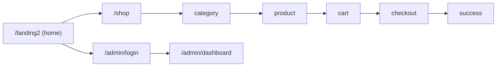
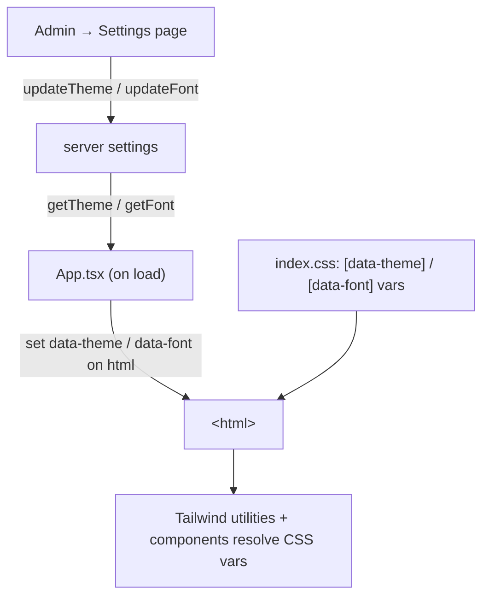

# Product Design

> Product, UX, and **visual design system** for the Jamhawi storefront + admin app.
> Focus: a single place to understand the product **and** to change **fonts / themes / colors** safely later.
> Companion doc: [routing-map.md](./routing-map.md) (every page & route).

Last generated: 2026-06-29

---

## 1. Product Overview

**Jamhawi** is a luxury e-commerce storefront with a full admin back office.

| | |
|---|---|
| **Users** | Shoppers (public storefront) · Store admins (protected `/admin`) |
| **Languages** | English + Arabic (RTL), via i18n ([src/i18n.ts](../src/i18n.ts)) |
| **Pricing** | Weight-based pricing engine, multi-currency with a configurable base currency |
| **Aesthetic** | Dark, gold-accented luxury storefront; light "stone" admin dashboard |

### Feature areas
- **Storefront** — landing, category/product browsing, cart, multi-currency checkout.
- **Admin** — dashboard, orders, products, inventory, categories, customers, offers, pricing, analytics, simulators, audit log, settings.
- **Theming** — admin-selectable global theme + font, applied to **all** users.

---

## 2. Pages & Flows

Full route table lives in [routing-map.md](./routing-map.md). High level:



- **Storefront** under `/shop/*` (also mirrored at root `/*` — see routing-map cleanup notes).
- **Admin** under `/admin/*`, gated by `ProtectedAdminRoute`.

---

## 3. Visual Design System

> ⚠️ **This is the section to edit when changing look & feel.** Source files are linked at each subsection — change them there, this doc documents them.

### 3.1 Where design tokens live

| Concern | Source of truth | Mechanism |
|---------|-----------------|-----------|
| Theme colors (selectable) | [src/index.css](../src/index.css) | CSS vars under `[data-theme="…"]` |
| Theme list (admin UI) | [src/pages/admin/Settings.tsx](../src/pages/admin/Settings.tsx) | `themes` array |
| Fonts (selectable) | [src/index.css](../src/index.css) | `@font-face` + `[data-font="…"]` |
| Font list (admin UI) | [src/pages/admin/Settings.tsx](../src/pages/admin/Settings.tsx) | inline font options array |
| Tailwind theme tokens | [src/index.css](../src/index.css) | `@theme { … }` block |
| Persisted selection | server settings via [src/lib/api/catalog.ts](../src/lib/api/catalog.ts) | `getTheme()` / `getFont()` |
| Applied at runtime | [src/App.tsx](../src/App.tsx) | sets `documentElement.dataset.theme` / `.font` |

**Runtime flow:** `App` calls `getTheme()`/`getFont()` → sets `data-theme` / `data-font` on `<html>` → CSS variables resolve → Tailwind utilities & components read them.

---

### 3.2 Colors

#### Selectable themes (storefront + admin, set by admin)

Each theme defines `--color-primary` and `--color-accent`. Defined in [src/index.css](../src/index.css) and mirrored in the admin picker.

| Theme | `--color-primary` | `--color-accent` | Swatch |
|-------|-------------------|------------------|--------|
| **Default (Classic)** | `#1C1C1C` | `#8C7A6B` | ⬛ 🟫 |
| **Ocean** | `#0F2C59` | `#DAC0A3` | 🟦 🟫 |
| **Forest** | `#1A3636` | `#D6BD98` | 🟩 🟫 |
| **Sunset** | `#451952` | `#F39F5A` | 🟪 🟧 |

Derived Tailwind tokens (in the `@theme` block):
```css
--color-luxury-bg:     #FAF9F6;            /* near-white surface */
--color-luxury-text:   var(--color-primary);
--color-luxury-accent: var(--color-accent);
```

#### Fixed brand colors (not theme-driven)

These are hard-coded (notably the storefront dark shell and gold). Search the codebase before changing — they appear in [src/index.css](../src/index.css) `body` and inline styles in [src/App.tsx](../src/App.tsx) / [src/components/Layout.tsx](../src/components/Layout.tsx).

| Token | Value | Used for |
|-------|-------|----------|
| Storefront background | `#131313` | `body` background, loaders |
| Storefront text | `#e5e2e1` | `body` text |
| Brand gold | `#f2ca50` | loaders, accents, highlights |
| Gold (muted border) | `rgba(212,175,55,0.2)` | loader ring |
| Admin surfaces | Tailwind `stone-*` | admin dashboard chrome |

> 🔧 **To add a theme:** add a `[data-theme="x"]` block in [src/index.css](../src/index.css) **and** an entry in the `themes` array in [src/pages/admin/Settings.tsx](../src/pages/admin/Settings.tsx).
> 🔧 **To recolor the storefront shell:** the dark `#131313` / gold `#f2ca50` are *not* in the theme system yet — consider migrating them to CSS vars if they should be themeable.

---

### 3.3 Typography

Fonts are loaded in [src/index.css](../src/index.css) (Google Fonts import + local `@font-face`).

#### Default font: **Maj** ⭐

`Maj` (local `public/fonts/maj.ttf`) is the **default font for the whole app**. It supports **both English and Arabic glyphs**, so it covers the storefront and admin in both languages.

#### Font families (Tailwind `@theme` defaults)
```css
--font-serif: "Maj", "Playfair Display", "Cairo", ui-serif, Georgia, …;  /* headings */
--font-sans:  "Maj", "Inter", "Cairo", ui-sans-serif, system-ui, …;       /* body */
```
- `Maj` is first in both stacks → it is the active font everywhere unless an admin override is selected.
- `Cairo` remains as a fallback for Arabic glyph coverage.
- Headings (`h1–h6`) use `font-serif font-medium tracking-tight` (base layer).
- Body uses `font-sans antialiased`.

#### Selectable fonts (admin-set, applied globally)

| Font option | id | Stack | Notes |
|-------------|----|-------|-------|
| **Maj (Default)** | `default` | `Maj` first (+ Playfair/Inter/Cairo fallbacks) | local `/fonts/maj.ttf`; **default**, EN + AR |
| **Majalla** | `majalla` | `Majalla` first, then Maj/Playfair/Inter + Cairo | local `/fonts/majalla.ttf`; elegant classic Arabic |

When `majalla` is active, `[data-font="majalla"]` overrides `--font-serif` / `--font-sans`. With no override (`default`), the `@theme` defaults apply → **Maj** (see [src/index.css](../src/index.css)).

#### Loaded sources
- **Local:** **Maj** — `public/fonts/maj.ttf` via `@font-face` (default).
- **Local:** Majalla — `public/fonts/majalla.ttf` via `@font-face`.
- **Google Fonts:** Playfair Display, Inter, Cairo (`@import` at top of [src/index.css](../src/index.css)) — now fallbacks only.

> 🔧 **To add a font:** (1) load it (`@import` or `@font-face`) in [src/index.css](../src/index.css); (2) add a `[data-font="x"]` override block; (3) add an option to the font array in [src/pages/admin/Settings.tsx](../src/pages/admin/Settings.tsx). It applies app-wide on save.

---

### 3.4 Layout & spacing

- Built with **Tailwind CSS v4** (`@import "tailwindcss"` + `@theme`).
- Two shells: storefront [Layout](../src/components/Layout.tsx) (dark, gold) and admin [AdminLayout](../src/components/AdminLayout.tsx) (light, stone).
- **Mobile-first** rules in the `@layer base` block of [src/index.css](../src/index.css):
  - Tap targets: buttons / `a[role=button]` min `44×44px`.
  - Inputs forced to `16px` to prevent iOS zoom.
  - `@media (max-width: 640px)` tweaks for `.product-card` / `.category-card`.
- Utility: `.mask-oval` (`clip-path: ellipse(...)`) for oval image masks.

---

## 4. Theming Architecture (how a change propagates)



Key point: **theme & font are global**, stored server-side, and applied to every visitor — not per-user.

---

## 5. Change Checklist (fonts / themes / colors)

When the team later wants to restyle:

- [ ] **New theme** → add `[data-theme]` block in [src/index.css](../src/index.css) + entry in `themes` array in [Settings.tsx](../src/pages/admin/Settings.tsx).
- [ ] **New font** → load font + `[data-font]` override in [src/index.css](../src/index.css) + option in [Settings.tsx](../src/pages/admin/Settings.tsx).
- [ ] **Recolor storefront shell** → migrate hard-coded `#131313` / `#f2ca50` / `#e5e2e1` to CSS vars (currently not themeable).
- [ ] **Global token tweak** → edit the `@theme { … }` block in [src/index.css](../src/index.css).
- [ ] Verify both **EN and AR (RTL)** render correctly after any font change.
- [ ] Verify both **storefront (dark)** and **admin (light)** shells.

---

## 6. Open Design Debt

1. Storefront dark/gold palette is **hard-coded**, not part of the selectable theme system.
2. Theme `--color-primary`/`--color-accent` are mainly consumed by the **admin** UI; storefront relies more on fixed colors — themes have limited visible effect on the storefront today.
3. Theme list is **duplicated** (CSS vars in `index.css` + JS array in `Settings.tsx`) — keep them in sync manually.
4. See [routing-map.md](./routing-map.md) for duplicate-route cleanup that affects navigation/IA.
