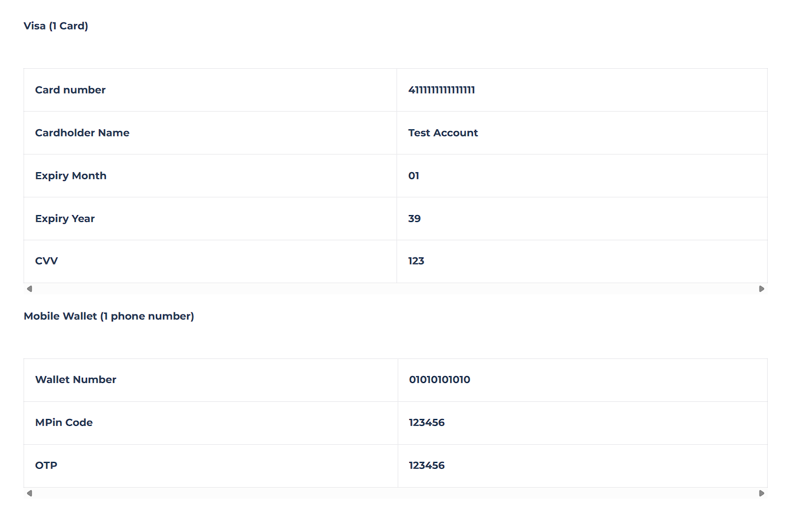

Here are the test credentials for the Online Card and Wallet payment methods:

Mastercard (2 Cards)

Card number

5123456789012346

Cardholder Name

Test Account

Expiry Month

01

Expiry Year

39

CVV

123

Card number: 5123456789012346
Cardholder Name: Test Account
Expiry : 01/39
CVV: 123

Card number: 5123450000000008
Cardholder Name: Test Account
Expiry : 01/39
CVV: 123

Card number

5123450000000008

Cardholder Name

Test Account

Expiry Month

01

Expiry Year

39

CVV

123

Visa (1 Card)

Card number

4111111111111111

Cardholder Name

Test Account

Expiry Month

01

Expiry Year

39

CVV

123

Mobile Wallet (1 phone number)

Wallet Number

01010101010

MPin Code

123456

OTP

123456

Was this section helpful?
Yes
No
image.png

- Converted from AED -> Converted from {currency}
- admin dashboard AED -> to variables
- add custom weights for the products -> default 2kg
-add the region
-> logo paymob is uncle jam
-> any circle logo to be uncle jam
->font majala discord saved
--> animation video
na5la btkbr
war2 shagr btnzl 3asl
btktb jamhawy

300 + 100 

------
paymob -> developer email 
change the WhatsApp numbers to his numbers

