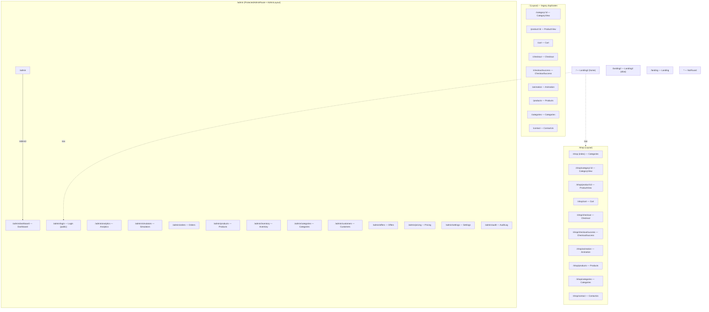
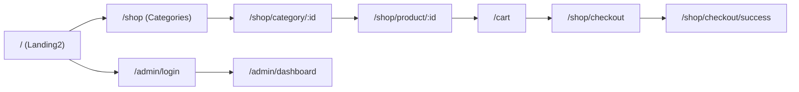

# Routing Map

> Single source of truth for every page/route in the app.
> All routes are defined in [`src/App.tsx`](../src/App.tsx) via `createBrowserRouter`.
> Use this as the reference when removing pages and re-routing.

Last generated: 2026-06-29

---

## 1. Quick Summary

| Area | Entry path | Layout | Auth |
|------|-----------|--------|------|
| Home | `/`, `/landing2` | none | public |
| Landing (alt) | `/landing` | none | public |
| Shop | `/shop/*` | `Layout` | public |
| Shop (legacy root) | `/*` | `Layout` | public |
| Admin | `/admin/*` | `AdminLayout` | protected |
| Fallback | `*` | none | public |

- `/` renders **`Landing2`** directly (the home page). `/landing2` is kept as an alias.
- `/shop` (index) renders **`Categories`**. There is no separate shop landing page.
- `/admin` (index) redirects to **`/admin/dashboard`**.
- Unmatched paths render **`NotFound`**.

---

## 2. Full Route Table

### Public / Landing

| Path | Component | File | Notes |
|------|-----------|------|-------|
| `/` | `Landing2` | [src/pages/Landing2.tsx](../src/pages/Landing2.tsx) | home page (rendered directly) |
| `/landing` | `Landing` | [src/pages/Landing.tsx](../src/pages/Landing.tsx) | |
| `/landing2` | `Landing2` | [src/pages/Landing2.tsx](../src/pages/Landing2.tsx) | alias of `/` |

### Shop (`/shop`, wrapped in `Layout`)

| Path | Component | File | Notes |
|------|-----------|------|-------|
| `/shop` | `Categories` | [src/pages/Categories.tsx](../src/pages/Categories.tsx) | index route — shop entry shows categories |
| `/shop/category/:id` | `CategoryView` | [src/pages/CategoryView.tsx](../src/pages/CategoryView.tsx) | dynamic `:id` |
| `/shop/product/:id` | `ProductView` | [src/pages/ProductView.tsx](../src/pages/ProductView.tsx) | dynamic `:id` |
| `/shop/cart` | `Cart` | [src/pages/Cart.tsx](../src/pages/Cart.tsx) | |
| `/shop/checkout` | `Checkout` | [src/pages/Checkout.tsx](../src/pages/Checkout.tsx) | |
| `/shop/checkout/success` | `CheckoutSuccess` | [src/pages/CheckoutSuccess.tsx](../src/pages/CheckoutSuccess.tsx) | |
| `/shop/animation` | `Animation` | [src/pages/Animation.tsx](../src/pages/Animation.tsx) | |
| `/shop/products` | `Products` | [src/pages/Products.tsx](../src/pages/Products.tsx) | |
| `/shop/categories` | `Categories` | [src/pages/Categories.tsx](../src/pages/Categories.tsx) | |
| `/shop/contact` | `ContactUs` | [src/pages/ContactUs.tsx](../src/pages/ContactUs.tsx) | |

### Shop — legacy root (`/`, wrapped in `Layout`) ⚠️ duplicate

> These mirror the `/shop/*` routes at the root. The same components are mounted at two paths.
> **Candidates for removal during re-routing.**

| Path | Component | Mirrors |
|------|-----------|---------|
| `/category/:id` | `CategoryView` | `/shop/category/:id` |
| `/product/:id` | `ProductView` | `/shop/product/:id` |
| `/cart` | `Cart` | `/shop/cart` |
| `/checkout` | `Checkout` | `/shop/checkout` |
| `/checkout/success` | `CheckoutSuccess` | `/shop/checkout/success` |
| `/animation` | `Animation` | `/shop/animation` |
| `/products` | `Products` | `/shop/products` |
| `/categories` | `Categories` | `/shop/categories` |
| `/contact` | `ContactUs` | `/shop/contact` |

### Admin (`/admin`, protected by `ProtectedAdminRoute` + `AdminLayout`)

| Path | Component | File | Auth |
|------|-----------|------|------|
| `/admin/login` | `AdminLogin` | [src/pages/admin/Login.tsx](../src/pages/admin/Login.tsx) | public |
| `/admin` | → redirect | — | → `/admin/dashboard` |
| `/admin/dashboard` | `AdminDashboard` | [src/pages/admin/Dashboard.tsx](../src/pages/admin/Dashboard.tsx) | protected |
| `/admin/analytics` | `AdminAnalytics` | [src/pages/admin/Analytics.tsx](../src/pages/admin/Analytics.tsx) | protected |
| `/admin/simulators` | `AdminSimulators` | [src/pages/admin/Simulators.tsx](../src/pages/admin/Simulators.tsx) | protected |
| `/admin/orders` | `AdminOrders` | [src/pages/admin/Orders.tsx](../src/pages/admin/Orders.tsx) | protected |
| `/admin/products` | `AdminProducts` | [src/pages/admin/Products.tsx](../src/pages/admin/Products.tsx) | protected |
| `/admin/inventory` | `AdminInventory` | [src/pages/admin/Inventory.tsx](../src/pages/admin/Inventory.tsx) | protected |
| `/admin/categories` | `AdminCategories` | [src/pages/admin/Categories.tsx](../src/pages/admin/Categories.tsx) | protected |
| `/admin/customers` | `AdminCustomers` | [src/pages/admin/Customers.tsx](../src/pages/admin/Customers.tsx) | protected |
| `/admin/offers` | `AdminOffers` | [src/pages/admin/Offers.tsx](../src/pages/admin/Offers.tsx) | protected |
| `/admin/pricing` | `AdminPricing` | [src/pages/admin/Pricing.tsx](../src/pages/admin/Pricing.tsx) | protected |
| `/admin/settings` | `AdminSettings` | [src/pages/admin/Settings.tsx](../src/pages/admin/Settings.tsx) | protected |
| `/admin/audit` | `AdminAuditLog` | [src/pages/admin/AuditLog.tsx](../src/pages/admin/AuditLog.tsx) | protected |

### Fallback

| Path | Component | File |
|------|-----------|------|
| `*` | `NotFound` | [src/components/NotFound.tsx](../src/components/NotFound.tsx) |

---

## 3. How users actually navigate (nav links)

Links currently exposed in the UI chrome:

**Desktop header** ([src/components/Layout.tsx](../src/components/Layout.tsx))
- Logo → `/landing2`
- Cart → `/cart`
- Contact → `/shop/contact`
- Admin → `/admin/login`

**Mobile menu** ([src/components/MobileMenu.tsx](../src/components/MobileMenu.tsx))
- Home → `/landing2`
- Categories → `/shop`
- Cart → `/cart`
- Contact → `/shop/contact`
- Admin → `/admin/login`

> ⚠️ Note the inconsistency: the cart link points at `/cart` (legacy root) while contact points at `/shop/contact`. Worth normalizing during re-routing.

---

## 4. Route Diagram



### User journey (happy path)



---

## 5. Cleanup notes for re-routing

1. **Duplicate shop routes** — every `/shop/*` page is also mounted at root `/*`. Pick one canonical prefix and remove the other (or add redirects).
2. **Inconsistent nav targets** — header/mobile menu mix `/cart` (root) with `/shop/contact` (prefixed). Normalize once a canonical prefix is chosen.
3. **Two landing pages** — `Landing` (`/landing`) appears unused by nav; only `Landing2` (`/landing2`) is linked. Confirm before removing `Landing`.
4. **`/animation`** — utility/demo route, not linked from nav; verify if still needed.
```
